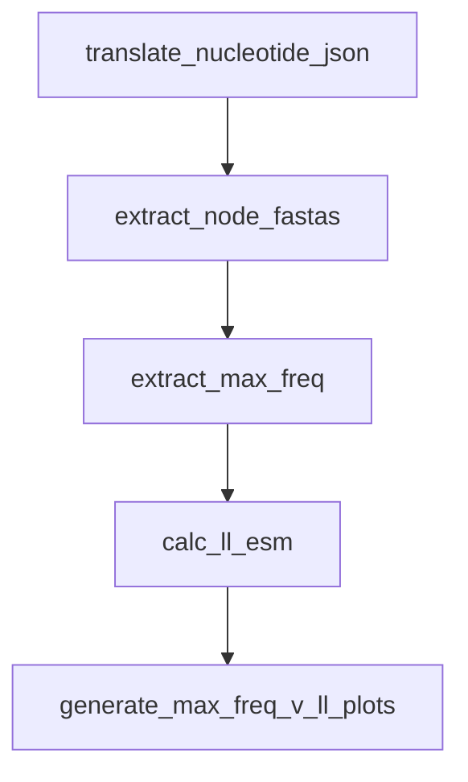

# ESM Selection

This is a colleciton of scripts and figures that went into the ESM selection project, currently in progress.

# Table of Contents

- [ESM Selection](#ESM-Selection-Intro)
- [Table of Contents](#table-of-contents)
- [Flu Snakemake Pipeline](#flu-snakemake-pipeline)
  - [Setup](#setup)
  - [Workflow](#workflow)
  - [Example](#example)
  - [Options](#options)
  - [Output](#output)
- [Figures](#figures)

# Flu Snakemake Pipeline

## Workflow



## Setup

Install nextstrain apptainer container and place in envs folder

``` bash
apptainer build nextstrain-base.sif docker://nextstrain/base
```

For running on Conatus Server:

Load Snakemake and PyTorch Module

``` bash
module load snakemake PyTorch/2.1.2-foss-2023a-CUDA-12.1.1
```

## Example

Run on 650M Model in parallel

``` bash
snakemake --cores 8 --resources gpu=8 --use-singularity --config model=650M
```  

Run on 3B Model in parallel

``` bash
snakemake --cores 8 --resources gpu=8 --use-singularity --config model=3B
```  

> [!WARNING]
Running the 15B model is memory intensive, it is recomended to not run all segments at once

Run on 15B Model

``` bash
snakemake --cores 1 --resources gpu=1 --use-singularity --config model=15B
```  

## Options

List commands for the pipline:

| Command  | Description |
| ---      | ---         |
| `--cores`  | How many cpus to allocate, more cores is faster as it will run processes in parallel
| `--resources` | Choose how many GPUs to allocate for ESM Log Likelihood Calculation, use `gpu=`
| `--use-singularity` | If running on conatus server use singularity
| `--use-conda` | Run Workflow with conda, used for local development on mac
|`--config` | Choose what model to run ESM with, options: 650M, 3B, 15B

## Output

```
├── max_freqs                                       # Extracted Max Frequencies from nextrain trees
│   ├── Max_Freq_Fasta_ha.csv
│   ├── Max_Freq_Fasta_mp.csv
│   ├── Max_Freq_Fasta_na.csv
│   ├── Max_Freq_Fasta_np.csv
│   ├── Max_Freq_Fasta_ns.csv
│   ├── Max_Freq_Fasta_pa.csv
│   ├── Max_Freq_Fasta_pb1.csv
│   └── Max_Freq_Fasta_pb2.csv
├── max_freqs_log_likelyhood_esm2_t33_650M_UR50D    # Extracted Log likelihood for 650M Model
│   ├── Max_Freq_Fasta_LL_esm2_t33_650M_UR50D_ha.csv
│   ├── Max_Freq_Fasta_LL_esm2_t33_650M_UR50D_mp.csv
│   ├── Max_Freq_Fasta_LL_esm2_t33_650M_UR50D_na.csv
│   ├── Max_Freq_Fasta_LL_esm2_t33_650M_UR50D_np.csv
│   ├── Max_Freq_Fasta_LL_esm2_t33_650M_UR50D_ns.csv
│   ├── Max_Freq_Fasta_LL_esm2_t33_650M_UR50D_pa.csv
│   ├── Max_Freq_Fasta_LL_esm2_t33_650M_UR50D_pb1.csv
│   └── Max_Freq_Fasta_LL_esm2_t33_650M_UR50D_pb2.csv
├── max_freqs_log_likelyhood_esm2_t36_3B_UR50D      # Extracted Log likelihood for 3B Model
│   ├── Max_Freq_Fasta_LL_esm2_t36_3B_UR50D_ha.csv
│   ├── Max_Freq_Fasta_LL_esm2_t36_3B_UR50D_mp.csv
│   ├── Max_Freq_Fasta_LL_esm2_t36_3B_UR50D_na.csv
│   ├── Max_Freq_Fasta_LL_esm2_t36_3B_UR50D_np.csv
│   ├── Max_Freq_Fasta_LL_esm2_t36_3B_UR50D_ns.csv
│   ├── Max_Freq_Fasta_LL_esm2_t36_3B_UR50D_pa.csv
│   ├── Max_Freq_Fasta_LL_esm2_t36_3B_UR50D_pb1.csv
│   └── Max_Freq_Fasta_LL_esm2_t36_3B_UR50D_pb2.csv
├── max_freqs_log_likelyhood_esm2_t48_15B_UR50D     # Extracted Log likelihood for 15B Model
│   ├── Max_Freq_Fasta_LL_esm2_t48_15B_UR50D_ha.csv
│   ├── Max_Freq_Fasta_LL_esm2_t48_15B_UR50D_mp.csv
│   ├── Max_Freq_Fasta_LL_esm2_t48_15B_UR50D_na.csv
│   ├── Max_Freq_Fasta_LL_esm2_t48_15B_UR50D_np.csv
│   ├── Max_Freq_Fasta_LL_esm2_t48_15B_UR50D_ns.csv
│   ├── Max_Freq_Fasta_LL_esm2_t48_15B_UR50D_pa.csv
│   ├── Max_Freq_Fasta_LL_esm2_t48_15B_UR50D_pb1.csv
│   └── Max_Freq_Fasta_LL_esm2_t48_15B_UR50D_pb2.csv
├── node_fastas                                     # Extracted Fasta per Node
│   ├── nodeSeqs_ha.fasta
│   ├── nodeSeqs_mp.fasta
│   ├── nodeSeqs_na.fasta
│   ├── nodeSeqs_np.fasta
│   ├── nodeSeqs_ns.fasta
│   ├── nodeSeqs_pa.fasta
│   ├── nodeSeqs_pb1.fasta
│   └── nodeSeqs_pb2.fasta
├── root_tree_translated                            # Translated Root Sequences
│   ├── h3n2_60y_ha_root-sequence.json
│   ├── h3n2_60y_mp_root-sequence.json
│   ├── h3n2_60y_na_root-sequence.json
│   ├── h3n2_60y_np_root-sequence.json
│   ├── h3n2_60y_ns_root-sequence.json
│   ├── h3n2_60y_pa_root-sequence.json
│   ├── h3n2_60y_pb1_root-sequence.json
│   └── h3n2_60y_pb2_root-sequence.json
```

## Figures

Scripts to generate figures are in `Figures.ipynb` notebook

`ESM_vs_Max_Freq_Plots` Contains figures comparing Max Freq to LL for all three models.
